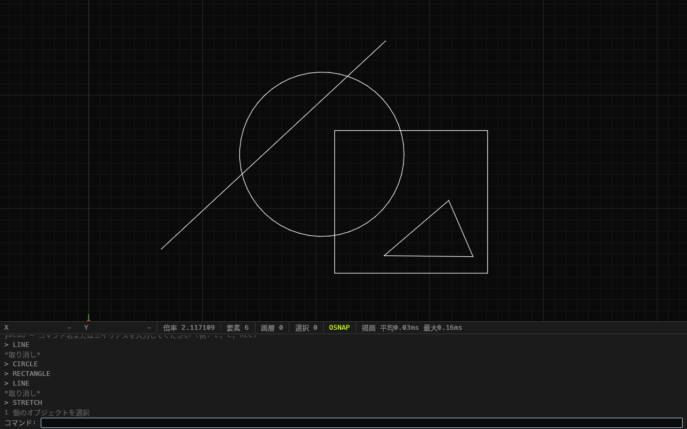

# ymcad

**AutoCAD ライクな操作性を持つ 2D 専用 CAD。Rust + egui 製、Ubuntu ネイティブ。**

[](https://github.com/yukimasui/ymcad/actions/workflows/ci.yml)




<sub>ステータスバーには倍率・要素数・画層・選択数・OSNAP の状態と、直近の描画時間が常に出ています。</sub>

## なぜ作ったか

仕事では 2D CAD を日常的に使っています。ただ、**趣味で使うには市販ソフトは高すぎ、
そして高機能すぎました。** サブスクリプションの年額を払い続けても、自分が実際に触るのは
全機能のごく一部です。

一方で、既存の無償 CAD に乗り換えると今度は**操作の癖を覚え直すコスト**がかかります。
`L` + `Enter` で線を引き、`@100<45` で相対極座標を打ち、右→左ドラッグで交差選択する ——
体に入った操作をそのまま使いたい。

そこで、**AI エージェントによる開発で、自分に必要な機能だけをコンパクトに作る**ことにしました。
機能の取捨選択を自分で握れるなら、「高すぎる」も「高機能すぎる」も同時に解けます。

この方針は README の飾りではなく、実装の隅々まで効いています。たとえば
AutoCAD のダイナミックブロックの「アクション」は GUI 上でパラメータと動きを紐付ける仕組みですが、
ymcad ではこれを**テキストの式**に置き換えました（[ADR-0031](docs/DECISIONS.md)）。
自分ひとりが使うツールなら、GUI でプログラミングさせるより式を書かせたほうが速いからです。

## 何ができるか

| | |
|---|---|
| **作図** | LINE / CIRCLE / ARC / RECTANGLE / POLYLINE / XLINE（無限作図線） |
| **編集** | ERASE / MOVE / COPY / STRETCH / ROTATE / SCALE / MIRROR / TRIM / EXTEND / FILLET / CHAMFER |
| **選択** | クリック / 窓選択（左→右）/ 交差選択（右→左）/ GROUP |
| **スナップ** | 端点・中点・中心・交点・垂線・最近点（ヒステリシス付きで吸着が暴れない） |
| **作図補助** | 直交モード（`F8`）・極トラッキング（`F10`、15° 刻み・補助線と角度表示）。独立したスイッチで、両方オンなら直交が優先 |
| **レイヤ** | 色・表示/非表示・ロック・線種をパネルで管理 |
| **コンポーネント** | 定義 + インスタンス。型付きパラメータと式で駆動。インプレース編集 |
| **入出力** | `.ymc`（ネイティブ・無損失）/ `.dxf`（R12・交換用） |
| **リボン** | 画面上端のタブつきアイコンバー（ホーム / コンポーネント / 表示・ファイル）と、どのタブでも押せる UNDO / REDO / SAVE。押すとコマンド名を打ったのと同じく始まる。アイコンは差し替えられる SVG |
| **その他** | Undo/Redo 256 段、コマンドライン UI、カーソル横の動的入力（`F12` で切替）、寸法入力（長さ・角度の欄と `Tab` での固定）、直接距離入力、座標直接入力、自動段階グリッド |

操作の詳細（コマンド一覧・キーバインド・各コマンドの振る舞い）は
**[操作マニュアル](docs/MANUAL.md)** にまとめてあります。

### 市販ソフトと違えた点

- **TRIM / EXTEND で切断エッジを選ばない。** 図面上の他の図形が自動的に境界になるので、
  いきなりクリックから始められます
- **コンポーネント化しても図形が消えない。** AutoCAD の `BLOCK` は選択を消しますが、
  ymcad は選択をその場でインスタンスに置き換えます（Figma と同じ挙動）
- **パラメータは式で駆動する。** `if 両開き then 幅 / 2 else 幅` のように書けて、
  **識別子に日本語が使えます**（`幅`、`扉の向き`）
- **日常操作は打たない。** 値の変更・配置・リセットはすべてパネルのマウス操作で、
  文字を打つのは名前を付けるときだけです。日本語入力を挟むと手が止まるためです

## 設計で守っていること

AI エージェントに実装を任せる以上、**「壊れてはいけないもの」を文章の規約ではなく
機械検査で守る**必要がありました。CI で毎回検査している不変条件がこれです。

| 検査項目 | 内容 |
|---|---|
| 依存方向 | コアが egui / eframe / winit / wgpu / rfd に依存しないこと |
| 精度 | コアの座標に `f32` が一切出てこないこと（`f64` 一貫） |
| 縮小変換の局所化 | `as f32` が `viewport.rs`（描画直前の 1 箇所）の外に出ないこと |
| トレランス | `1e-9` 等の直書きが `geom/tolerance.rs` の外に無いこと（テストコードも対象） |

このほか、設計の骨格として次を型で強制しています。

- **エンティティを変更できるのは `Command` だけ。** `EditCtx` を唯一の経路とし、
  `pub(crate)` + private ZST の封印 + `&mut EditCtx`（`&mut Document` ではない）の
  3 層で、Undo 履歴を経由しない変更をコンパイルエラーにしています
- **エンティティストアは世代つきアリーナ。** `Vec` の添字を ID にしないので、
  削除済み ID の使い回しによる誤参照が起きません
- **派生データ（ラバーバンド・空間インデックス・描画キャッシュ）は `Document` に入れない。**
  UI 側に持ち、`Document::revision()` をキーに再構築します

### ラウンドトリップテストの盲点を埋める

ファイル入出力のテストは「自分で書いて自分で読む」ため、**書き手と読み手が同じ誤解を
していれば往復が成立してしまい、書き出しのバグを見逃します。**

そこで `tools/` に **Rust とは独立した Python 実装の検証スクリプト**を置き、CI で走らせています。
バイナリ形式の `.ymc` はエディタで開いても構造が見えないぶん、この盲点がテキスト形式より
深いためです。いちばん効いた検査は「**パースが末尾でぴったり尽きること**」でした。

```bash
cargo run -p cad-core --example write_sample -- /tmp/sample.ymc
python3 tools/validate_ymc.py /tmp/sample.ymc --verbose
```

## 規模

| | |
|---|---|
| Rust コード | 約 38,000 行（コア 24,800 / UI 13,300） |
| テスト | **1,029 件**（`cargo test --workspace`、全通過） |
| 設計判断の記録 | ADR **33 件**（[`docs/DECISIONS.md`](docs/DECISIONS.md)） |
| コアの依存パッケージ | **0**（将来 wasm ビューアを載せる余地を残すため） |

## ビルドと実行

### Ubuntu の依存パッケージ

```bash
sudo apt install build-essential pkg-config libssl-dev \
  libgtk-3-dev libxkbcommon-dev libwayland-dev
sudo apt install fonts-noto-cjk   # 日本語 UI 用（未導入だと文字が □ になります）
```

### ビルド

```bash
cargo build --release
cargo run --release
```

Wayland で不調な場合は X11 (XWayland) へフォールバックできます。

```bash
WAYLAND_DISPLAY= cargo run --release
```

> `WINIT_UNIX_BACKEND` は winit 0.30 で廃止されています。winit は `WAYLAND_DISPLAY` が
> 空なら `DISPLAY` を見て X11 を選ぶため、上記のように環境変数を空にして起動します。

## ドキュメント

| | |
|---|---|
| [`docs/MANUAL.md`](docs/MANUAL.md) | 操作マニュアル（コマンド一覧・キーバインド・ファイル形式） |
| [`docs/ARCHITECTURE.md`](docs/ARCHITECTURE.md) | アーキテクチャと死守する設計原則 |
| [`docs/DECISIONS.md`](docs/DECISIONS.md) | ADR。**採らなかった選択肢とその理由**を必ず残しています |
| [`docs/PROGRESS.md`](docs/PROGRESS.md) | 現在地・積み残し・既知の落とし穴 |
| [`docs/ROADMAP.md`](docs/ROADMAP.md) | 非スコープの整理（3D / 幾何拘束ソルバ / 印刷 / DWG など） |

## 構成

```
crates/
├── cad-core/   ジオメトリ・エンティティ・コマンド・ファイル入出力（UI 非依存・依存パッケージ 0）
└── cad-app/    egui アプリケーション（入力処理・描画。リボンのアイコン SVG は assets/icons/）
tools/          書き出したファイルを Rust とは別実装で検証する Python スクリプト
docs/           マニュアル・アーキテクチャ・ADR・進捗
```

## 開発

```bash
cargo fmt --all -- --check
cargo clippy --workspace --all-targets -- -D warnings
cargo test --workspace
cargo build --workspace --release
```

これらに加えて、上で述べた別実装での書き出し検証と、アーキテクチャ不変条件の
機械検査が CI で自動的に走ります。

## ライセンス

MIT
